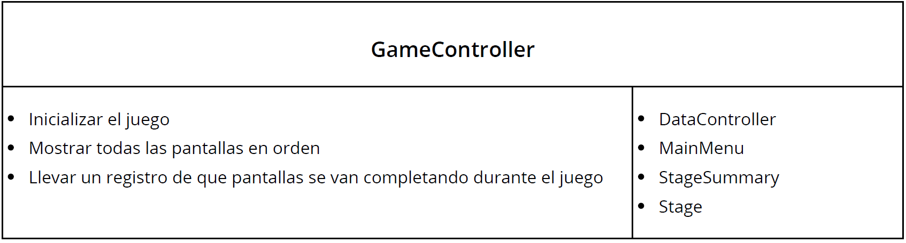
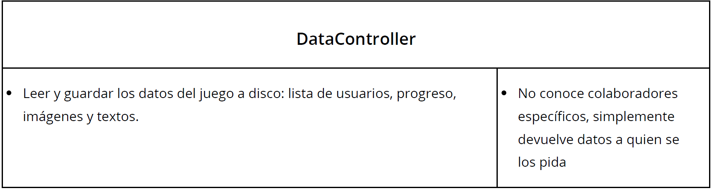
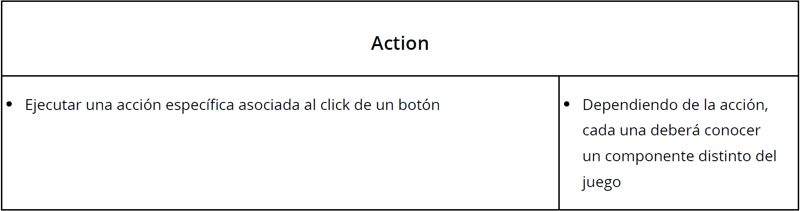
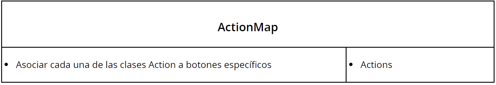
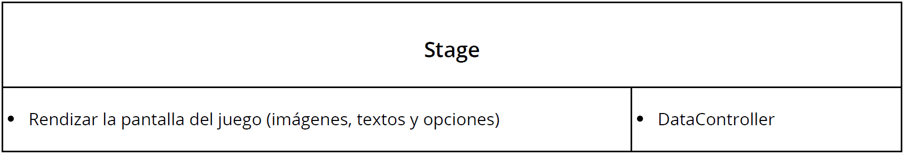

Sebastian Bevc, Franco Pereira, Enzo Bueno, Federico Becoña

## Proyecto - Interpretando al mundo

## Breve introducción:

El motivo de la aplicación a desarrollar es ayudar a niños con Asperger con una edad cercana a los 12 años. El trastorno de Asperger incide en el desarrollo emocional de sus padecientes, generándoles dificultades para relacionarse con los demás, discernir contextos sociales y generar empatía.

Para brindarles apoyo, la aplicación mostrará distintas pantallas con imágenes dándole al usuario opciones para inferir qué es lo que está sintiendo/pensando la persona de la imagen y para entender el contexto social implícito. Si la opción elegida es correcta se le da un feedback positivo y se muestra otra situación/contexto social. En el juego hay tres niveles, "Reconocimiento de emociones", "Inferencias" e "Ironía y chistes"; cada uno de ellos tiene tres pantallas que van aumetando en dificultad.

## Programa
Al iniciar el programa éste nos lleva a un menú principal, el cual nos permite elegir/crear un usuario y empezar a jugar. Al comenzar se nos muestra un resumen del progreso del usuario con las pantallas que se hayan pasado y las que queden por hacer, permitiendo elegir en qué pantalla jugar dentro de las que ya hayamos desbloqueado al haberlas superado.

Cada pantalla consta de una imagen que muestra un cierto contexto social y da distintas opciones al usuario para inferir dicho contexto. Si la opción es correcta se le da feedback positivo y consulta si desea seguir jugando o salir del juego. Si la opción no es correcta se le da la opción de volver a intentarlo.

## CRC Cards - Class, Responsibilities and Collaborators

Adhiriendo al diseño **Model-View-Controller**, la organización global de las clases se da la siguiente forma:

Model: Clases encargadas del manejo de datos (usuarios ya registrados, imágenes, textos y composición de los mismos para formar una vista individual).
  * **DataController**
 
View: Clases encargadas de la representación de los elementos en pantalla, fuertemente relacionadas con elementos de Unity.
  * **Stage**
 
**Controller**: Manejo de la lógica y secuencia del juego, respondiendo a los eventos que genere el usuario
 * **GameController**
 * **Action**
 * **ActionMap**

### Clases explicadas

- Se encarga de que el programa mantenga el flujo de escenas correctamente así como de llevar cuenta el progreso del usuario durante el progrma.
- Al empezar el juego se encarga de inicializar la instancia de *ActionMap* así como de mostrar *MainMenu* y, cada vez que una *Stage* es completada se ocupa de llamar a la siguiente en el orden correcto.
- Al completar una pantalla le pasa el progreso realizado a *DataController* para que lo guarde.

- Aplicando el principio **Expert**, *DataController* es la única clase que sabe leer y escribir archivos a disco. Conoce la estructura de los datos: dónde se guarda cada dato relacionado a los usuarios, el progreso del juego y qué imágenes y textos componen cada pantalla. Cuando otra clase requiera algún dato guardado, *DataController* será la encargada de enviárselos.

- Cada acción ejecutada por un botón en el juego será una clase que cumpla con el contrato Execute(), adhiriendo así al **Command Pattern**.

- Se encarga de mapear todas las *Action* con los eventos OnClick() que vaya generando el usuario durante el juego utilizando el **Observer**. 

-Es quien se ocupa de vincular los *Action* relacionados a los botones dentro de cada escena con el *GameController*.

## Secuencia de mensajes entre objetos
Al abrir el ejecutable correspondiente al programa, la clase “Game Controller”, que contiene el método “Main()”, con herramientas de Unity crea una ventana en la que se muestra el programa e instancia a la clase "Data Controller" a la que le envía un mensaje para que abra la escena correspondiente a “Main Menu”, esta se muestre y pueda comenzar el juego. También se crea la instancia de la clase “Action Map” quien durante la ejecución escucha los eventos generados por los botones utilizando el Observer y así les asigna las acciones que les correspondan. En lo anterior se puede ver la existencia de composición y delegación.

El funcionamiento de la clase “Action Map” se puede lograr manteniendo ciertas convenciones a la hora de nombrar los elementos del juego, por ejemplo si acordamos que todas las opciones correctas se nombran con un sufijo "_ correct answer". 
Por otra parte, tiene la ventaja de que todos los botones del juego son sumamente simples: solo llaman a “Action Map”. Entendemos también que es pertinente aplicar el patrón 
ton para que haya una única instancia en el juego que contenga el mapeo de la lógica.

La clase "Data Controller” cumple con el principio Expert al ser la única que sabe leer y escribir archivos a disco, esta es la responsable de conocer la lista de usuarios con sus progresos (los cuales son guardados en un archivo “.txt”) y los path de las imágenes de las distintas escenas. Cuando otra clase requiera algún dato guardado esta será la encargada de mandarselos.

El “Game Controller” es el responsable de conocer el orden de las pantallas el cual no se pretende que pueda ser modificable. Este le envía mensajes a "Data Controller" para que esta cargue las escenas de Unity que se quieren mostrar en la ventana.

Hay una escena para el Menú Principal (“Main Menu”), otra para un visualizador del avance del usuario (“Stage Summary”) y una por cada uno de los niveles juego. Cada una de ellas tiene un script "Stage" y uno “Action”, este último está asociado a los botones que aparecen en pantalla, los cuales provienen de un prefab “Button”. En las distintas etapas del programa, al apretar un botón, “Action” llama a un método de "Stage", dependiendo de qué botón se trate, lo cual es asignado por “Action Map”. Por ejemplo, si quiere cambiar de pantalla, se envía un mensaje al “Game Controller” para que pase a la siguiente pantalla cuyo path es conocido por “Data Controller”.

Al iniciar el programa, el objeto “Game Controller” creado, carga en la pantalla de forma automática la escena de Unity correspondiente al “Main Menu”. En esta escena, hay un espacio para escribir el nombre del usuario para cargar el estado de juego, en caso de haber jugado antes, o para crearse una nueva cuenta escribiendo un nombre que no esté registrado previamente; además hay un botón “Play”. El espacio tiene un script asociado que le envía su contenido al “Game Controller” el cual lo pasa al objeto “Data Controller”. Cada vez que se escriba un nombre, “Data Controller” lo busca en un archivo de texto “.txt” que tiene todas las cuentas creadas junto con su progreso, si esta encuentra al nombre en el archivo se almacena el valor en “Game Controller”, de lo contrario escribe en el documento el nombre junto con el nivel correspondiente a avance nulo.
 
En las distintas pantallas del programa existen botones con diferentes acciones, que se encuentran programadas en la clase “Action” correspondiente a cada una, la cual es determinada por la clase “Action Map”. Cada acción ejecutada por un botón en el juego es una clase que cumple con el contrato “Execute ()” adhiriendo al command pattern.

Ejemplos de Actions:
-ShowPositiveFeedback*: Mostrar una ventana “Pop-Up" de felicitaciones y notificarle a Game Controller que se pasa al siguiente nivel para que lo muestre en pantalla.
-RestartLevel*: Si se clickea un botón incorrecto también se abre una ventana “Pop-Up" con un mensaje de “Inténtelo de nuevo” y un botón “Restart level” cuyo “Command()” le diría a Game Controller que abra nuevamente el mismo nivel.
 -ShowMainMenu*: En cada nivel también hay un botón para acceder al “Main Menu” cuyo “Command()” hace que el “Stage” le envíe un mensaje al “Game Controller” para cargar desde el “Data Controller” la pantalla “Main Menu”.

Siguiendo con este esquema cada acción está encapsulada en una clase que puede ser reutilizada por varios botones, cumpliendo con los patrones Open/Closed (agregar funcionalidad implica agregar más clases que cumplan con el contrato y no implica cambiar clases existentes) y Single responsibility Principle (cada clase tiene una única razón para cambiar, que se modifique por algún motivo su acción).Esto también proporciona la ventaja del bajo acoplamiento: cada boton no sabe lo que está haciendo, sino que su método OnClick() simplemente llama a una acción determinada en tiempo de ejecución por ActionMap. De esta forma es simple agregar nueva funcionalidad (solo hay que agregar más clases con las respectivas acciones) y permite una reutilización de comportamiento sin duplicar código.

Luego de que el usuario escribe un nombre y aprieta el botón “Play”, el método “Execute()”, en este caso, llama a un método de "Stage" que modifica el valor del avance almacenado en “Game Controller” correspondiente a la pantalla actual y se envía un mensaje a “Data Controller” con el nombre de la scene de Unity que tiene que reproducir, en este caso “Stage Summary” y también se le pide que guarde el nuevo avance del usuario en el archivo “.txt”.

La pantalla “Stage Summary” contiene todos los niveles con una distinción de colores entre los que ya fueron superados y los que no. En este caso el "Stage" le pregunta al “Game Controller” por el valor de la variable de avance de juego del usuario y en base a ella pinta determinadas imágenes de un color y otras de otro. Allí el usuario puede apretar en cualquier pantalla que no esté “bloqueada”, esto se maneja con la variable anteriormente mencionada “n” sabiendo que el participante solo puede acceder a las pantallas que sean menores o iguales a n+1. Dependiendo de la escena sobre la que se apriete, el método “Execute()” llama a una determinada escena y “Data Controller” es el encargado de abrirla en pantalla.

Cada escena es manejada con una clase "Stage" que se asocia con un script, este se encuentra vinculado al relacionado con los distintos botones de la pantalla. Estos últimos son los encargados de comenzar la secuencia de mensajes entre objetos para avanzar en el juego.

En cada nivel hay una fotos con una opción correcta y las demás falsas. Estas imágenes están almacenadas en carpetas con el nombre de la escena y con nombres distintos si son verdaderas o falsas. Las clases "Stage" de las distintas escenas le piden a “Data Controller” las imágenes pasándole por parámetro sus nombres de forma aleatoria para que así, si se juega una pantalla varias veces, la opción correcta no salga siempre en el mismo lugar. Además, de esta forma el psicólogo o acompañante podrá cambiar las imágenes y el juego seguirá teniendo sentido, siempre y cuando se guarde la imagen correcta con el nombre especificado para la opción válida y lo mismo con las falsas dentro de la carpeta de fotos de la escena correspondiente. Así se le brinda una mayor versatilidad al programa.

Durante el proceso mencionando en el párrafo anterior se almacena el orden aleatorio de las imágenes enviadas a la pantalla por lo que se puede identificar la ubicación de la imagen correcta dado que se sabe su nombre. En los niveles hay un botón debajo de cada imagen para que estas puedan ser seleccionadas. Como los botones de las pantallas se encuentran ordenados según su ubicación, las imágenes también y se sabe la posición correspondiente a la imagen correcta, el “Action Map” manda un mensaje a cada uno de los botones creados dentro de la escena de Unity y “settea” una variable dependiendo de si el botón tiene una opción verdadera o una falsa (se sabe viendo si el botón se encuentran en la misma posición que la imagen correcta o no).

En caso de que en una pantalla se apriete el botón correcto se le manda un mensaje a "Stage" para que aparezca una ventana “Pop-Up” que tenga un texto de “Felicitaciones” y un botón “Play next level” cuyo “Command()” genera que "Stage" le mande un mensaje a “Game Controller” para sumar uno a la variable correspondiente al último nivel jugado y que este le diga a “Data Controller” que actualice el estado de avance guardado del usuario y que cargue en pantalla la escena de Unity correspondiente al siguiente nivel.

Si se aprieta un botón incorrecto también se abre una ventana “Pop-Up" con un mensaje de “Inténtelo de nuevo” y un botón “Restart level” cuyo “Command()” envia un mensaje desde “Game Controller” a “Data Controller” para que se cargue la misma pantalla nuevamente.

En cada nivel también hay un botón para acceder al “Main Menu” cuyo “Command()” hace que el "Stage" le envíe un mensaje al “Game Controller” para cargar desde el “Data Controller” la pantalla “Main Menu”.

Al llegar a la última pantalla y apretar la opción correcta, el “Stage” abre un "Pop-Up" que dice felicitaciones has ganado y el programa finaliza.
